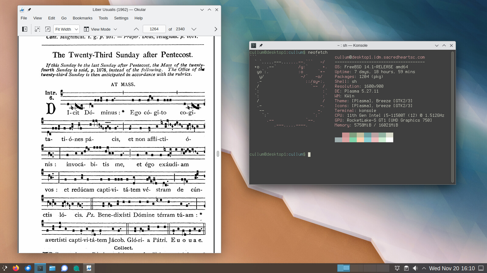

After [much deliberation](../reevaluating-rhel/), I finally decided to migrate my entire
infrastructure from [Rocky Linux](https://rockylinux.org/) to [FreeBSD](https://www.freebsd.org/).

Why FreeBSD? Perhaps you yearn for a simpler time, when `ifconfig` configured your network
interfaces. When `/etc/motd` didn't download advertisements from the web. When adults actually
packaged their software, instead of shipping 400 MB Flatpaks that make syscalls
over D-Bus.

Rest easy, weary netizen. While the [teenagers](https://www.jwz.org/doc/cadt.html) busy
themselves with `systemd-resolved`, Netplan, and other horrors, 
you can still find peace in the tranquility of `/etc/rc.conf`. The enemy,
ensnared by the YAML tarpit, is not **yet** at our gates (*sic transit gloria mundi*, etc).

Anyway, let's build a FreeBSD desktop system with KDE. This guide will assume you're using
Intel graphics with X11 (don't @ me about Wayland 🤡).

On my 5-year-old ThinkPad X1 Carbon, I'm getting about 6-7 hours of battery life
with FreeBSD. Not too bad!

{.center}

## Installation

Grab a FreeBSD memstick image from [here](https://www.freebsd.org/where/) and `dd` it
to a USB stick:

```bash
curl -OJ https://download.freebsd.org/releases/amd64/amd64/ISO-IMAGES/14.1/FreeBSD-14.1-RELEASE-amd64-memstick.img
sudo dd if=FreeBSD-14.1-RELEASE-amd64-memstick.img of=/dev/sdX bs=1M conv=sync
```

The installation wizard is straightforward. Make sure your system is configured for UEFI boot,
and select ZFS (GPT) for the disk layout.

Once you reboot, login as root using the password specified during installation.

## Devices, Drivers, and Tuning

In this section, we'll configure device drivers and make various tweaks to
get optimum performance out of a desktop system.

You're not required to use *all* of these, but they've worked well for me.

### Bootloader Tunables

First, open up `/boot/loader.conf` and consider adding the following:

```bash
# /boot/loader.conf

# Faster boot time.
autoboot_delay="3"

# Load PF firewall module.
pf_load="YES"

# Enable querying CPU information and temperature.
cpuctl_load="YES"
coretemp_load="YES"

# 99% of users will never need destructive dtrace.
security.bsd.allow_destructive_dtrace="0"

# Bump up some default limits for desktop usage.
kern.ipc.shmseg="1024"
kern.ipc.shmmni="1024"
kern.maxproc="100000"

# If your system supports Intel Speed Shift (check dmesg), set this to 0:
machdep.hwpstate_pkg_ctrl="0"

# Enable PCI power saving.
hw.pci.do_power_nodriver="3"

# Optimizations for Intel graphics.
compat.linuxkpi.i915_enable_fbc="1"
compat.linuxkpi.i915_fastboot="1"

# Enable this module to use USB tethering (Android/iPhone)
if_urndis_load="YES"

################
# Network tuning 
################
# H-TCP congestion control algorithm designed to perform better over fast,
# long-distance networks (like the internet). You might consider using it.
cc_htcp_load="YES"

# Enable faster soreceive() implementation.
net.inet.tcp.soreceive_stream="1"

# Increase network interface queue length.
net.isr.defaultqlimit="2048"
net.link.ifqmaxlen="2048"

########################
# Laptop-related options
########################
# Increase ZFS transaction timeout to save battery.
vfs.zfs.txg.timeout="10"

# Power saving for Intel graphics.
compat.linuxkpi.i915_disable_power_well="1"
compat.linuxkpi.i915_enable_dc="2"

# Enable Thinkpad buttons.
acpi_ibm_load="YES"
```

### Sysctl Tweaks

Next, open up `/etc/sysctl.conf` and consider setting the following sysctls.
Note that you can view the description of any sysctl by running `sysctl -d`.

```bash
# /etc/sysctl.conf

####################
# sEcuRitY HaRdeNinG
####################
hw.kbd.keymap_restrict_change=4
kern.coredump=0
kern.elf32.aslr.pie_enable=1
kern.random.fortuna.minpoolsize=128
kern.randompid=1
net.inet.icmp.drop_redirect=1
net.inet.ip.process_options=0
net.inet.ip.random_id=1
net.inet.ip.redirect=0
net.inet.ip.rfc1122_strong_es=1
net.inet.tcp.always_keepalive=0
net.inet.tcp.drop_synfin=1
net.inet.tcp.icmp_may_rst=0
net.inet.tcp.syncookies=0
net.inet6.ip6.redirect=0
security.bsd.unprivileged_proc_debug=1
security.bsd.unprivileged_read_msgbuf=0

# Some guides will tell you use these.
# More trouble than they're worth, IMO:
#
#kern.elf32.allow_wx=0
#kern.elf64.allow_wx=0
#security.bsd.hardlink_check_gid=1
#security.bsd.hardlink_check_uid=1
#security.bsd.see_other_gids=0
#security.bsd.see_other_uids=0

##################################
# Network performance tuning
#
# The default values for many of these sysctls are optimized for the latencies
# of a local network. The modifications below should result in better TCP
# performance over connections with a larger RTT (like the internet), but at
# the expense of higher memory utilization.
#
# source: trust me, bro
###############################
kern.ipc.maxsockbuf=2097152
kern.ipc.soacceptqueue=1024
kern.ipc.somaxconn=1024
net.inet.tcp.abc_l_var=44
net.inet.tcp.cc.abe=1
net.inet.tcp.cc.algorithm=htcp
net.inet.tcp.cc.htcp.adaptive_backoff=1
net.inet.tcp.cc.htcp.rtt_scaling=1
net.inet.tcp.ecn.enable=1
net.inet.tcp.fast_finwait2_recycle=1
net.inet.tcp.fastopen.server_enable=1
net.inet.tcp.finwait2_timeout=5000
net.inet.tcp.initcwnd_segments=44
net.inet.tcp.keepcnt=2
net.inet.tcp.keepidle=62000
net.inet.tcp.keepinit=5000
net.inet.tcp.minmss=536
net.inet.tcp.msl=2500
net.inet.tcp.mssdflt=1448
net.inet.tcp.nolocaltimewait=1
net.inet.tcp.recvbuf_max=2097152
net.inet.tcp.recvspace=65536
net.inet.tcp.sendbuf_inc=65536
net.inet.tcp.sendbuf_max=2097152
net.inet.tcp.sendspace=65536
net.local.stream.recvspace=65536
net.local.stream.sendspace=65536

#######################
# Desktop optimizations
#######################
# Prevent shared memory from being swapped to disk.
kern.ipc.shm_use_phys=1

# Increase scheduler preemption threshold for snappier GUI experience.
kern.sched.preempt_thresh=224

# Allow unprivileged users to mount things.
vfs.usermount=1

# Don't switch virtual consoles back and forth on suspend.
# With some graphics cards, switching to a different VT breaks hardware acceleration.
# https://github.com/freebsd/drm-kmod/issues/175
kern.vt.suspendswitch=0

########################
# Power saving (laptops)
########################
hw.snd.latency=7
```

### WiFi

WiFi is not where FreeBSD shines. Hope you can live with 802.11g.

First, you'll need to figure out which driver supports your card (if any). For Intel
cards, this will likely be `iwn(4)`, `iwm(4)`, or `iwlwifi(4)`. Check those man pages.

My card happens to be an Intel Wireless AC 8265, which is supported by the `iwm` driver.

First, make sure the required kernel modules are loaded on boot:

```bash
# /boot/loader.conf

if_iwm_load="YES"
iwm8265fw_load="YES"
```

Next, have `rc(8)` create a `wlan0` device on boot:

```bash
sysrc -v wlans_iwm0=wlan0
sysrc -v create_args_wlan0='country US regdomain FCC'
sysrc -v ifconfig_wlan0='WPA DHCP powersave'
```

The `WPA` option will use `wpa_supplicant(8)` to manage WiFi networks. You can either
edit `/etc/wpa_supplicant.conf` by hand, or use the graphical interface provided by
`networkmgr`:

```bash
pkg install sudo networkmgr
```

Note that `networkmgr` requires root permissions. You can allow all members of the
`operator` group to run `networkmgr` without a password using `sudo`:

```bash
# /usr/local/etc/sudoers.d/networkmgr

%operator ALL=NOPASSWD: /usr/local/bin/networkmgr
```

### CPU Microcode and Power Savings

Install the latest CPU microcode:

```bash
pkg install cpu-microcode
```

Edit `/boot/loader.conf` to load the microcode on boot:

```bash
# /boot/loader.conf

cpu_microcode_load="YES"
cpu_microcode_name="/boot/firmware/intel-ucode.bin"
```

You can save a lot of battery (and heat) by enabling lower CPU C-states:

```bash
sysrc -v performance_cx_lowest=Cmax economy_cx_lowest=Cmax
```

Note that with modern Intel processors, it is no longer necessary to run `powerd(8)`.

### Intel Graphics Driver

Install the Intel graphics driver and make sure it's loaded on boot:

```bash
pkg install drm-kmod libva-intel-media-driver
sysrc -v kld_list+=i915kms
```

### Linux Binary Compatibility

The [Linuxulator](https://wiki.freebsd.org/Linuxulator) allows you to run Linux binaries on FreeBSD:

```bash
sysrc -v linux_enable=YES
```

### Allow Filesystems in Userspace

If you ever need to mount "foreign" filesystems, you'll need FUSE:

```bash
sysrc -v kld_list+=fusefs
```

### Webcam

With any luck, your webcam will be supported by `webcamd`:

```bash
pkg install webcamd v4l-utils
sysrc -v webcamd_enable=YES
```

### Sound

Many ports are built with [sndio](https://sndio.org/) support by default (like Firefox).
You can think of it as a BSD-native `pulseaudio`.

```bash
pkg install sndio
sysrc -v sndiod_enable=YES

# There appears to be a race condition with sndiod and clear_tmp_enable.
# When /tmp is cleared out on boot, the sndiod socket is inadvertently removed!
sysrc -v clear_tmp_enable=NO
```

#### Using different audio devices simultaneously

FreeBSD's OSS has an unfortunate limitation: only one audio device
can be used at a time. For example, I was unable to use my webcam's integrated
microphone and my USB speakers simultaneously during video chats.

As described on the [FreeBSD Wiki](https://wiki.freebsd.org/Sound#virtual_oss_.28advanced.29),
the `virtual_oss(8)` package exists to work around this limitation:

```bash
pkg install virtual_oss
```

First, check the contents of `/dev/sndstat` to determine your device numbering:

```
$ cat /dev/sndstat
Installed devices:
pcm0: <vendor 0x046d HD Pro Webcam C920> (rec)
pcm1: <Audioengine Ltd. Audioengine 2+> (play) default
```

Since my output (`-O`) device has index 1, and my recording (`-R`) device has
index 0, I'll enable `virtual_oss` like so:

```bash
sysrc -v virtual_oss_enable=YES
sysrc -v virtual_oss_dsp='-T /dev/sndstat -C 8 -c 8 -S -r 48000 -b 16 -s 100ms -O /dev/dsp1 -R /dev/dsp0 -d dsp' 
```

You'll need to set the `-r` flag to the sample rate and `-b` to the bit depth of your device
(you can usually find these values in `dmesg`).
If your devices have different sample rates, the `-S` flag enables automatic resampling.

The `-s` flag sets the buffer size. I had to increase this to `100ms` to avoid clipping.

The `-c` and `-C` flags set the number of channels. I originally had this set to 2, but
found that any video with surround sound had no audio. VLC printed the following error:

```
oss audio output error: cannot set 6 channels
```

Bumping this up to 8 solved the issue.

### Device Permissions via devfs

You should create a custom `devfs(8)` ruleset to allow unprivileged users to access
various hardware devices. Create `/etc/devfs.rules` with the following:

```ini
# /etc/devfs.rules

[localrules=1000]
add path 'drm/*'       mode 0660 group operator
add path 'backlight/*' mode 0660 group operator
add path 'video*'      mode 0660 group operator
add path 'usb/*'       mode 0660 group operator
```

If you plan on burning CDs, you will need a few more lines. First, check
the output of `camcontrol devlist` to determine the `pass(4)` device associated
with your CD burner:

```
$ camcontrol devlist
<AHCI SGPIO Enclosure 2.00 0001>   at scbus0 target 0 lun 0 (ses0,pass0)
<CL1-3D256-Q11 NVMe SSSTC 256GB 22301116>  at scbus1 target 0 lun 1 (pass1,nda0)
<HL-DT-ST BD-RE BU40N 1.03>        at scbus2 target 0 lun 0 (cd0,pass2)
```

In my case, `cd0` is associated with `pass2`, so I will add the following:

```ini
add path 'xpt*'        mode 0660 group operator
add path 'cd*'         mode 0660 group operator
add path 'pass2'       mode 0660 group operator
```

Be sure to set the default ruleset like so:

```bash
sysrc -v devfs_system_ruleset=localrules
```

### USB Power Saving

If you're using a laptop, you'll want to power down inactive USB devices
to save battery life.

Add the following to `/etc/rc.local`:

```bash
# /etc/rc.local

usbconfig | awk -F: '{ print $1 }' | xargs -rtn1 -I% usbconfig -d % power_save
```

### ThinkPad Backlight Controls

I had to do a bit of work to get the backlight keys working on my ThinkPad
X1 Carbon.

First make sure the `acpi_ibm` kernel module is loaded:

```bash
kldload acpi_ibm
```

Then, set the following sysctl to allow `devd(8)` to handle the button events:

```bash
sysctl dev.acpi_ibm.0.handlerevents='0x10 0x11'
```

We'll need a `devd(8)` rule to handle these events. Create `/etc/devd/thinkpad-brightness.conf`
with the following:

```
# /etc/devd/thinkpad-brightness.conf

notify 20 {
  match "system"    "ACPI";
  match "subsystem" "IBM";
  match "notify"    "0x10";
  action            "/usr/local/libexec/thinkpad-brightness up";
};

notify 20 {
  match "system"    "ACPI";
  match "subsystem" "IBM";
  match "notify"    "0x11";
  action            "/usr/local/libexec/thinkpad-brightness down";
};
```

Finally, create the following script at `/usr/local/libexec/thinkpad-brightness`:

```bash
#!/bin/sh

# /usr/local/libexec/thinkpad-brightness

case $1 in
  up)
      if [ "$cur" -ge 50 ]; then
        delta=10
      elif [ "$cur" -ge 10 ]; then
        delta=5
      else
        delta=2
      fi

      /usr/bin/backlight incr "$delta"
    ;;
  down)
      if [ "$cur" -le 10 ]; then
        delta=2
      elif [ "$cur" -le 50 ]; then
        delta=5
      else
        delta=10
      fi

      /usr/bin/backlight decr "$delta"
    ;;
esac
```

Don't forget to make it executable:

```bash
chmod 755 /usr/local/libexec/thinkpad-brightness
```

### Reboot

Reboot to apply these changes and make sure you didn't break anything:

```bash
reboot
```

## PF Firewall

It's sensible to block unexpected incoming connections. Create `/etc/pf.conf` with
the following:

```bash
# /etc/pf.conf

# Replace this with the names of your network interfaces.
egress = "{ em0, wlan0, ue0 }"

allowed_tcp_ports = "{ ssh }"
# If you do any voice/video chats, you may need to open UDP ports for RTP.
allowed_udp_ports = "{ 1024:65535 }"

set block-policy return
set skip on lo

scrub in on $egress all fragment reassemble
antispoof quick for $egress

block all
pass out quick on $egress inet
pass in quick on $egress inet proto icmp all icmp-type { echoreq, unreach }

pass in quick on $egress inet proto tcp to port $allowed_tcp_ports
pass in quick on $egress inet proto udp to port $allowed_udp_ports
```

Activate the firewall:

```bash
sysrc -v pf_enable=YES
service pf start
```

## Disable Periodic Scripts

Out of the box, FreeBSD includes a bunch of `periodic(8)` scripts that churn
through your hard disk, reach out to the internet, and send emails. I disable
most of these. You can check `/etc/defaults/periodic.conf` for a full list.

```bash
sysrc -v -f /etc/periodic.conf \
  daily_backup_aliases_enable=NO \
  daily_backup_gpart_enable=NO \
  daily_backup_passwd_enable=NO \
  daily_clean_disks_verbose=NO \
  daily_clean_hoststat_enable=NO \
  daily_clean_preserve_verbose=NO \
  daily_clean_rwho_verbose=NO \
  daily_clean_tmps_verbose=NO \
  daily_show_info=NO \
  daily_show_success=NO \
  daily_status_disks_enable=NO \
  daily_status_include_submit_mailq=NO \
  daily_status_mail_rejects_enable=NO \
  daily_status_mail_rejects_enable=NO \
  daily_status_mailq_enable=NO \
  daily_status_network_enable=NO \
  daily_status_security_enable=NO \
  daily_status_uptime_enable=NO \
  daily_status_world_kernel=NO \
  daily_status_zfs_zpool_list_enable=NO \
  daily_submit_queuerun=NO \
  monthly_accounting_enable=NO \
  monthly_show_info=NO \
  monthly_show_success=NO \
  monthly_status_security_enable=NO \
  security_show_info=NO \
  security_show_success=NO \
  security_status_chkmounts_enable=NO \
  security_status_chksetuid_enable=NO \
  security_status_chkuid0_enable=NO \
  security_status_ipf6denied_enable=NO \
  security_status_ipfdenied_enable=NO \
  security_status_ipfwdenied_enable=NO \
  security_status_ipfwlimit_enable=NO \
  security_status_kernelmsg_enable=NO \
  security_status_logincheck_enable=NO \
  security_status_loginfail_enable=NO \
  security_status_neggrpperm_enable=NO \
  security_status_passwdless_enable=NO \
  security_status_pfdenied_enable=NO \
  security_status_tcpwrap_enable=NO \
  weekly_locate_enable=NO \
  weekly_show_info=NO \
  weekly_show_success=NO \
  weekly_status_security_enable=NO \
  weekly_whatis_enable=NO
```

## Add Users

Create your local user account. Make sure to add yourself to the `operator` and
`wheel` groups.

```bash
pw useradd           \
  -n robertlee       \
  -c 'Robert E. Lee' \
  -s /bin/sh         \
  -M 700             \
  -d /home/robertlee \
  -G operator,wheel
```

You'll probably want to install `sudo`:

```bash
pkg install sudo
```

Update `/usr/local/etc/sudoers` to give sudo permissions to the `wheel` group:

```
# /usr/local/etc/sudoers

%wheel ALL=(ALL:ALL) ALL
```

## Set Locale

Set your locale for login shells in `/etc/login.conf`. Modify this file as shown
below with your preferred locale:

```diff
--- login.conf
+++ login.conf
@@ -23,7 +23,9 @@
        :umtxp=unlimited:\
        :priority=0:\
        :ignoretime@:\
-       :umask=022:
+       :umask=022:\
+       :charset=UTF-8:\
+       :lang=en_US.UTF-8:
```

Rebuild the login database to apply this change:

```bash
cap_mkdb /etc/login.conf
```

For non-login shells, create `/etc/profile.d/locale.sh` like so:

```bash
# /etc/profile.d/locale.sh

export LANG=en_US.UTF-8
export CHARSET=UTF-8
```

## Enable NTP

`ntpd(8)` will keep your system clock up-to-date.

Edit `/etc/ntp.conf` with your preferred NTP servers:

```
tos minclock 3 maxclock 6

pool 0.freebsd.pool.ntp.org iburst
pool 2.freebsd.pool.ntp.org iburst

restrict default limited kod nomodify notrap noquery nopeer
restrict source  limited kod nomodify notrap noquery

restrict 127.0.0.1
restrict ::1

leapfile "/var/db/ntpd.leap-seconds.list"
```

Start `ntpd`:

```bash
sysrc -v ntpd_enable=YES ntpd_sync_on_start=YES
service ntpd start
```

## Set the Timezone

In case you didn't do this during the installation, set your timezone:

```bash
ln -sfhv /usr/share/zoneinfo/America/New_York /etc/localtime
```

## Switch to openssh-portable

The `ssh` in FreeBSD's base system is heavily patched with stuff I don't use.
I prefer to use the vanilla `openssh-portable` from ports.

```bash
pkg install openssh-portable
```

Edit `/usr/local/etc/ssh/sshd_config` as appropriate:

```bash
# /usr/local/etc/ssh/sshd_config

PermitRootLogin prohibit-password

UsePAM yes
UseDNS no

Subsystem sftp /usr/local/libexec/sftp-server
```

Replace the running `sshd` with the new one:

```bash
sysrc -v sshd_enable=NO openssh_enable=YES
service sshd stop
service openssh start
```

The `ssh` command will continue using the base system's `/usr/bin/ssh` unless
you update your `$PATH`.

You can edit `/etc/login.conf` to make the change for all users:

```diff
--- login.conf
+++ login.conf
@@ -4,7 +4,7 @@
        :welcome=/var/run/motd:\
        :setenv=BLOCKSIZE=K:\
        :mail=/var/mail/$:\
-       :path=/sbin /bin /usr/sbin /usr/bin /usr/local/sbin /usr/local/bin ~/bin:\
+       :path=/sbin /bin /usr/local/sbin /usr/local/bin /usr/sbin /usr/bin ~/bin:\
        :nologin=/var/run/nologin:\
        :cputime=unlimited:\
        :datasize=unlimited:\
```

Rebuild the login database to apply this change:

```bash
cap_mkdb /etc/login.conf
```

## Fix 256-color XTerm

The `termcap(5)` database on FreeBSD has an [issue](https://bugs.freebsd.org/bugzilla/show_bug.cgi?id=280679)
which prevents "bright" colors from rendering on `xterm`-like terminals.

You can fix it by installing `terminfo-db`:

```bash
pkg install terminfo-db
```

## Install Root Certificates

FreeBSD trusts a limited number of certificate authorities out of the box.
Install the root CA bundle from Mozilla to trust all the standard ones:

```bash
pkg install ca_root_nss
```

## Install KDE and Desktop Applications

Grab a cup of coffee and kick back while you install KDE and all the desktop packages.
You might not want all of these, they're just what I find useful.

```bash
pkg install \
  audacious-plugins-qt5 \
  audacious-qt5 \
  chromium \
  digikam \
  elisa \
  en-hunspell \
  firefox \
  freedesktop-sound-theme \
  k3b \
  kde5 \
  kid3-kf5 \
  kmix \
  konversation \
  libreoffice \
  libva-utils \
  libvdpau-va-gl \
  merkuro \
  plasma5-sddm-kcm \
  sddm \
  signal-desktop \
  thunderbird \
  vdpauinfo \
  xorg
```

## Install Fonts

You'll find that some websites don't render quite right without these fonts installed:

```bash
pkg install \
  cantarell-fonts \
  droid-fonts-ttf \
  inconsolata-ttf \
  noto-basic \
  noto-emoji \
  roboto-fonts-ttf \
  ubuntu-font \
  webfonts
```

And of course, how can you live without [Terminus](https://files.ax86.net/terminus-ttf/):

```bash
pkg install terminus-font terminus-ttf
```

If you want to use the bitmapped version, you'll need to update `xorg.conf.d`:

```
# /usr/local/etc/X11/xorg.conf.d/terminus.conf

Section "Files"
  FontPath "/usr/local/share/fonts/terminus-font/"
EndSection
```

## Enable D-Bus

D-Bus is required for KDE and just about every GUI application these days.

```bash
sysrc -v dbus_enable=YES
service dbus start
```

## Configure SDDM

[sddm](https://github.com/sddm/sddm) is the preferred login manager for KDE. Enable and start it:

```bash
sysrc -v sddm_enable=YES
service sddm start
```

With any luck, you'll be dumped to a graphical login screen where you can launch KDE.

KDE under Wayland won't even start for me. To prevent my wife from accidentally selecting
it, I disabled Wayland in `sddm.conf(5)` like so:

```ini
# /usr/local/etc/sddm.conf

[General]
DisplayServer = x11

[Wayland]
SessionDir = /dev/null
```

Hopefully by the time Wayland runs on FreeBSD, the RedHat teenagers will have
moved on to another display server. X11 works fine.

## Known Issues

This section describes what doesn't work on FreeBSD, and some potential workarounds.

### User switching is broken

There is a long-standing [ConsoleKit2 bug](https://bugs.freebsd.org/bugzilla/show_bug.cgi?id=221452)
that prevents user switching from working reliably on FreeBSD.

There is [another bug](https://github.com/freebsd/drm-kmod/issues/175) that results in broken graphics
acceleration whenever a VT switch is performed.

Therefore, it's best to just disable user switching for now. You can disable it for
all users by adding the following to `/usr/local/etc/xdg/kdeglobals`:

```
# /usr/local/etc/xdg/kdeglobals

[KDE Action Restrictions]
action/start_new_session=false
action/switch_user=false
```

### Processes aren't killed on logout

On FreeBSD, multiple processes remain running indefinitely after logging out
of a KDE session. Chromium is especially annoying: it continues running after logout, but gets
trapped in some crazy state where it consumes 100% of a CPU core forever.

I imagine the KDE developers are mostly concerned with systemd-based Linux distributions,
where `logind` ensures that all processes associated with a user session are forcibly killed
when the user logs out. So this probably isn't on anyone's radar.

Luckily, KDE Plasma has the ability to run a cleanup script whenever a user logs out. Create the
following directory:

```bash
mkdir -p /usr/local/etc/xdg/plasma-workspace/shutdown
```

Then create `/usr/local/etc/xdg/plasma-workspace/shutdown/cleanup.sh` like so:

```bash
#!/bin/sh

# /usr/local/etc/xdg/plasma-workspace/shutdown/cleanup.sh

# Some processes don't kill themselves when the X server dies.
# This script takes care of them.
pkill signal-desktop chrome baloo_file dirmngr
pkill -f /usr/local/libexec/geoclue-2.0/demos/agent
```

Don't forget to make this file executable:

```bash
chmod +x /usr/local/etc/xdg/plasma-workspace/shutdown/cleanup.sh
```

### Baloo creates a gazillion .nfs files

If you have NFS-mounted home directories (like I do), you may notice that your
homedir is littered with hundreds of `.nfs` files.

KDE comes with a file indexing service called Baloo. Baloo seems to keep lots of open file
handles on the files it's indexing. If these files get deleted, the NFS [silly rename](https://linux-nfs.org/wiki/index.php/Server-side_silly_rename)
hack is triggered, causing a bunch of `.nfs` files to be created.

I've read that Baloo doesn't index network mounts, but apparently it does (at least on FreeBSD).

You can disable Baloo for all users by creating `/usr/local/etc/xdg/baloofilerc` with the following:

```ini
# /usr/local/etc/xdg/baloofilerc

[Basic Settings]
Indexing-Enabled=false
```

### Hardware video acceleration broken in Chromium

Video playback in Chromium is supposed to be hardware-accelerated using [VA-API](https://wiki.archlinux.org/title/Hardware_video_acceleration).
However, despite installing `libva-intel-media-driver`, my CPU was pegged at 60% or so when watching a YouTube video.

I blindly copy-pasted dozens of command-line flags for Chromium until I found the
incantation that enabled hardware-accelerated video playback:

```bash
chrome --enable-features=Vulkan,VulkanFromANGLE,DefaultANGLEVulkan
```

With those magic flags, CPU usage does not noticeably increase during video playback.

To make this change permanent, you can use a custom `.desktop` override for Chromium.
First, create a new directory to hold our custom `.desktop` files:

```bash
mkdir -p /usr/local/share-override/applications
```

Then, you must set the `$XDG_DATA_DIRS` environment variable so your new directory takes precedence:

```diff
--- login.conf
+++ login.conf
@@ -2,7 +2,7 @@
        :passwd_format=sha512:\
        :copyright=/etc/COPYRIGHT:\
        :welcome=/var/run/motd:\
-       :setenv=BLOCKSIZE=K:\
+       :setenv=BLOCKSIZE=K,XDG_DATA_DIRS=/usr/local/share-override\c/usr/local/share:\
        :mail=/var/mail/$:\
        :path=/sbin /bin /usr/local/sbin /usr/local/bin /usr/sbin /usr/bin ~/bin:\
        :nologin=/var/run/nologin:\
```

And, as usual:

```bash
cap_mkdb /etc/login.conf
```

Finally, create a custom `chromium-browser.desktop` file like so:

```ini
# /usr/local/share-override/desktop/chromium-browser.desktop

[Desktop Entry]
Type=Application
Version=1.0
Encoding=UTF-8
Name=Chromium
Comment=Google web browser based on WebKit
Icon=chrome
Exec=chrome --enable-features=Vulkan,VulkanFromANGLE,DefaultANGLEVulkan %U
Categories=Application;Network;WebBrowser;
MimeType=text/html;text/xml;application/xhtml+xml;x-scheme-handler/http;x-scheme-handler/https;x-scheme-handler/ftp;
StartupNotify=true
```

Luckily, video acceleration in Firefox seems to work properly without any fiddling.

### Screen tearing

Until the X11 people cut a release containing [this PR](https://gitlab.freedesktop.org/xorg/xserver/-/merge_requests/1006),
you will experience some screen tearing with the default modesetting driver.

Allegedly, you can install the `xf86-video-intel` driver and enable the `TearFree` option in `xorg.conf`.
However, I believe this driver is largely unmaintained, so YMMV.

I found that screen tearing is greatly reduced by setting **Latency** to *Force lowest latency* under
System Settings → Display and Monitor → Compositor.

Please do not tell me to use Wayland. At the time of this writing, it does not work.
