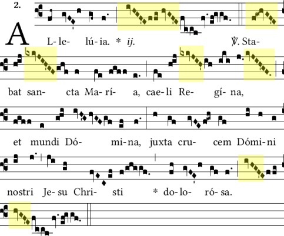

This Sunday the Church celebrates Our Lady of Sorrows. This feast was originally
authorized in 1692 by Pope Innocent XII to honor the sorrow that the Blessed Virgin
Mary suffered so perfectly throughout her earthly life with Our Lord Jesus Christ.

Devotion to the Seven Sorrows of Mary began to flourish in the 13th century, thanks
to the seven founders of the Order of the Servants of Mary. Our Lady's Seven Sorrows
are:

1. St. Simeon's prophecy: "thy own soul a sword shall pierce"
2. The flight into Egypt
3. The loss of the child Jesus in the temple
4. The meeting of Jesus and Mary on the Way of the Cross
5. Our Lord's crucifixion
6. Our Lord's descent from the cross
7. Our Lord's burial

The Mass for this feast is one of only five in the traditional Roman Missal which
retain the honor of a sequence: the Stabat Mater. The English version of this hymn,
"At the Cross Her Station Keeping," is traditionally sung at Stations of the Cross
during Lent.

The feast was originally celebrated on the third Sunday in September, but Pope Saint
Pius X moved it to a fixed date of September 15th. A sad result of this decision
(given the lack of traditional Masses in our time) is that most Catholics are
unlikely to ever hear the sublime chants for this feast in a Sung Mass.

The Alleluia for this Mass is perhaps the most heavy-hearted you'll find in the Liber
Usualis:

> Alleluia, Alleluia.
> Stabat sancta Maria, caeli Regina, et mundi Domina,
> juxta crucem Domini nostri Jesu Christi dolorosa.
> Alleluia.

In English:

> Holy Mary, queen of heaven and mistress of the world, stood, filled with sorrow,
> by the cross of our Lord Jesus Christ.

{.center}

Long, descending scales are a unique motif of this particular chant, which I have
highlighted above. This melodic pattern occurs quite rarely in the Church's liturgy.
The descending notes call to mind the tears which fell from the eyes of our Blessed
Mother at the foot of the cross.

And yet, even as we look upon her Son, hanging upon a cross and pierced with a lance:
Alleluia, Alleluia. How much Holy Mother Church teaches us, even through Her
melodies!

<iframe class="ytembed" src="https://www.youtube.com/embed/9dD7kMDtDEg" title="Alleluia: Stabat sancta Maria" frameborder="0" allow="accelerometer; autoplay; clipboard-write; encrypted-media; gyroscope; picture-in-picture; web-share" referrerpolicy="strict-origin-when-cross-origin" allowfullscreen></iframe>
